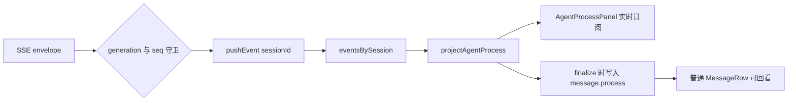

## Context

F2 已通过 generation SSE 接收增量事件，F3 用 `generationId + seq` 隔离回复，F5 将消息放入动态高度虚拟列表。过程事件目前写进一个全局 `events` 数组，而且只有当前会话可写入。现有 `EventTimeline` 没有接入聊天页，只能逐条打印协议字段。

## Goals / Non-Goals

**Goals:**

- 后台与前台 generation 的过程事件都按会话正确归位。
- 将成对事件合并成步骤，并表达运行、完成、提醒、失败和取消状态。
- 流式阶段实时展示，终态后在对应消息内保留快照。
- 对重复回放、缺少开始事件、可恢复错误和超长事件流保持稳定。
- 用户界面不暴露敏感参数与内部错误。

**Non-Goals:**

- 跨刷新恢复已完成轮次的过程历史。
- 服务端补充统一调用 ID 或修改事件持久化 schema。
- 展示模型内部推理原文。
- 商品结果卡片和来源面板。

## Proposed Approach

### Event identity and storage

`TradeEvent` 增加可选 `generation_id` 与 `seq`。`agentProcessStore.pushEvent(sessionId, event)` 使用二者组成身份键；已经存在的事件直接忽略。`beginRun(sessionId)` 在用户启动新一轮时清空该会话旧事件，`clearSession` 只删除一个分片，`reset` 用于退出登录。

### Pure projection

`projectAgentProcess(events)` 顺序扫描最多 160 条事件并返回：

- `steps`: 用户可见步骤；
- `status`: `idle / running / completed / cancelled / failed`；
- `completedCount`: 已完成或提醒步骤数量；
- `activeLabel`: 当前步骤标题。

工具结果从后向前寻找同工具名且状态为 `running` 的步骤。找不到时创建结果步骤，以兼容断线恢复只收到结果或旧事件缺失的情况。`final.result` 将仍在运行的步骤收口为完成，`cancelled` 收口为取消，终态 `error` 收口为失败。

### Safe summaries

摘要函数只读取明确允许的字段：搜索词、命中数、Agent 类型、任务状态数量、压缩后的消息数、模型名称和缓存相似度。订单工具、地址类参数与未知载荷只显示工具的人类可读名称，不显示原值。错误事件映射为固定用户文案。

### UI placement

`AgentProcessPanel` 位于助手消息正文之前。运行时默认展开，标题显示当前步骤与完成数量；完成后默认收起，用户可以通过按钮回看。步骤列表使用细线与状态圆点表达顺序，不创建独立侧栏或弹窗。

### Chat integration

两个 generation 订阅路径使用同一个过程事件写入函数。发送新消息时先调用 `beginRun`。收到任何非 `user.message`、非 `token.delta` 事件时先写过程 store，再处理正文与终态。真正终态到达时，先投影当前事件并把 `steps` 写入助手消息，再执行原有收流。

诊断 `error` 通过 payload 分类：存在字符串 `error` 时视为 generation 失败；只有 `message` 或 `retrying` 时写入过程提醒，不结束流。

## Public Interfaces

- `TradeEvent.generation_id?: string`
- `TradeEvent.seq?: number`
- `ChatMessage.process?: AgentProcessStep[]`
- `useAgentProcessStore.beginRun(sessionId)`
- `useAgentProcessStore.pushEvent(sessionId, event)`
- `useAgentProcessStore.clearSession(sessionId)`
- `projectAgentProcess(events)`

## Validation Plan

- 纯函数测试：工具配对、孤立结果、重复事件、计划更新、缓存、降级、诊断错误、终态错误、取消与敏感字段。
- store 测试：会话分片、重复 seq、单会话 160 条上限、单会话清理和全局重置。
- 组件测试：运行中默认展开、完成后默认收起、状态文字、`aria-expanded` 和安全文案。
- 集成测试：流式气泡显示实时步骤，普通助手消息显示冻结步骤。
- 命令：`npm test`、`npm run build`、OpenSpec validate。
- 浏览器：1280 px 与 375 px，分别检查长工具名、长中文、展开收起、暗色模式和减少动态效果。

## Rollback

删除投影模块和过程面板，恢复 `agentProcessStore` 的单数组接口，并移除 `ChatMessage.process` 即可。没有数据库迁移和外部状态需要回滚。

## Open Questions

无阻塞问题。同名工具并行配对依赖后端调用 ID，留到协议需要并行同名工具时处理。
