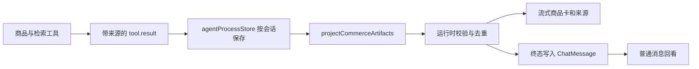

## Context

F2 已建立 generation SSE，F3 用 generation 与序号隔离回复，F6 能把过程步骤冻结到助手消息。现有 `ProductCards` 只读取最后一次工具结果并直接进行 TypeScript 类型断言，没有运行时数据边界，也没有接入 `VirtualMessageList`。后端目录、知识库和网页搜索都拥有来源信息，但事件协议没有把它完整、安全地交给界面。

## Goals / Non-Goals

**Goals:**

- 商品目录事实、到手价计算、分类知识和网页结果都能提供可验证来源。
- 网络数据进入组件前完成运行时校验，坏项不会影响整条消息。
- 流式消息显示实时结果，结束后在当前页面保留同一份快照。
- 商品卡和来源面板在桌面、手机、浅色和深色模式下都清晰可用。
- 所有链接与展开控件满足基本安全性和键盘可访问性。

**Non-Goals:**

- 刷新后恢复已完成轮次的结构化结果。
- 构建完整的句子级引用协议。
- 服务端渲染商品 HTML 或信任模型生成的引用标记。
- 支持同轮并行多组商品搜索结果。

## Proposed Approach

### Backend source contract

来源采用统一的最小结构：`source_id`、`source_type`、`label`、`summary`，可选 `fields` 与 `url`。目录来源声明它支撑的商品字段；到手价来源声明计算字段；知识与网页来源只携带长度受限的摘要。工具事件不暴露完整内部文档、请求头或错误堆栈。

### Runtime projection boundary

`projectCommerceArtifacts(events)` 接收 `unknown` 事件数据，不依赖类型断言。它逐项解析商品、金额和来源，数值必须有限且非负，必填字符串必须非空。非法商品或来源被单独跳过，危险 URL 被移除。商品结果取本 generation 最后一次成功的 `product_search`，来源按 `source_id` 稳定去重。

### Live and frozen state

流式助手气泡根据当前会话事件实时投影。收到 generation 终态时，`chatStore` 在清理事件前投影并把 `products` 与 `sources` 写入对应助手消息。普通消息只读冻结快照，避免后来事件改变旧回答。

当前历史接口只返回文本，所以本功能与 F6 一样，只承诺当前页面生命周期和活动 generation 重放期间可见。后续若需要跨刷新恢复，应扩展历史消息协议，而不是从回答文字反向解析商品。

### UI composition

商品卡使用响应式网格，价格是第一视觉锚点，品牌、品类、产地、规格和亮点按阅读优先级排列。到手价不存在时不显示空占位。每张卡的“查看依据”只展示该商品引用；回答级知识和网页来源放在卡片下方的内联折叠区，避免使用占据聊天宽度的固定抽屉。

按钮使用原生元素并提供 `aria-expanded` 与 `aria-controls`。外部链接只在 URL 通过校验后渲染，并设置 `target="_blank"` 与 `rel="noopener noreferrer"`。交互动效短且支持减少动态效果偏好。

## Public Interfaces

- `CitationSourceType = "catalog" | "calculation" | "knowledge" | "web"`
- `CitationSource { source_id, source_type, label, summary, fields?, url? }`
- `ProductCard.citations: CitationSource[]`
- `ChatMessage.products?: ProductCard[]`
- `ChatMessage.sources?: CitationSource[]`
- `projectCommerceArtifacts(events): { products, sources }`

## Validation Plan

- 后端测试：目录引用、到手价引用、知识来源与网页来源的安全摘要。
- 投影测试：合法数据、坏项隔离、非有限金额、危险 URL、重复来源和最后成功结果。
- store 测试：终态冻结商品与来源，诊断事件不提前冻结。
- 组件测试：价格层级、无到手价、展开收起、链接安全属性和空状态不渲染。
- 集成测试：流式气泡实时展示，完成消息保留冻结结果。
- 命令：后端测试、前端测试、类型检查、生产构建和 OpenSpec 严格校验。
- 浏览器：1280 px 与 375 px，检查浅色、深色、长中文、无到手价和来源展开状态。

## Rollback

移除新增来源字段、投影模块和 UI 接入，并删除 `ChatMessage` 的可选快照字段即可。所有协议字段均为兼容性扩展，没有数据库迁移或外部状态需要回滚。

## Open Questions

无阻塞问题。若后端开始并行执行多个同名商品搜索，事件协议需要增加 `result_group_id` 后再支持多组结果。
