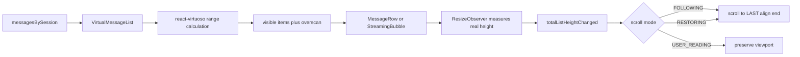

## Context

F2 已把 token 更新按动画帧合并，F3 已按会话隔离消息，F4 已支持动态高度的 Markdown、代码块和表格。当前 `ChatPage` 仍用 `messages.map` 全量渲染，并由 `AutoScrollBottom` 在消息数量、流式文本或会话变化时执行 `scrollIntoView`。

这套实现有两个结构性问题：消息总数决定 DOM 总数；滚动策略没有用户意图，用户只要上滑就会被下一个 token 拉回底部。F5 必须在不改变消息模型和 SSE 链路的前提下，同时处理虚拟窗口、动态高度测量和滚动锚定。

## Goals / Non-Goals

**Goals:**

- 只挂载可视区和 overscan 范围内的消息节点。
- 支持 Markdown、代码块和流式助手消息的未知高度与持续增高。
- 用户在底部时自动跟随；用户上滑后保持阅读位置。
- 会话切换时清空前一会话的尺寸缓存和滚动意图。
- 提供键盘可操作的“回到最新”控制。
- 用单元测试和浏览器验收覆盖核心滚动契约。

**Non-Goals:**

- 历史消息分页、向上加载和服务端游标。
- 自研高度索引、二分查找、DOM 节点池或虚拟列表内核。
- 平滑滚动动画。动态高度下平滑滚动目标会持续变化，使用即时定位更稳定。
- 修改后端、消息 id 生成、Markdown 解析或 token 合帧策略。

## Proposed Approach

### Component boundary

新增 `VirtualMessageList`，接收当前会话消息、流式消息 id、加载态和会话 id。它拥有 Virtuoso handle、滚动状态机和消息行渲染。`ChatPage` 只保留路由、输入框和发送控制。

`VirtualMessageList` 作为第三方库适配层，业务页面不直接调用 Virtuoso API。未来替换虚拟化内核时，变更限制在该组件和测试。

## Decisions

### D1. 采用开源 `react-virtuoso`

Virtuoso 默认测量动态 item，并提供 `atBottomStateChange`、`totalListHeightChanged`、`followOutput`、`scrollToIndex` 和 `computeItemKey`。这些 API 正好覆盖聊天列表。相比之下，TanStack Virtual 需要业务层组合测量、总高度和绝对定位；`react-window` 的动态高度缓存更偏手工管理。

只使用开源 `react-virtuoso`，不使用商业授权的 `@virtuoso.dev/message-list`。

### D2. 滚动意图使用三态而不是单个布尔值

- `FOLLOWING`：接近底部，允许新消息和高度变化推动视口。
- `USER_READING`：离开底部，禁止程序化贴底。
- `RESTORING`：用户点击“回到最新”或发送新消息后，正在恢复到底部；列表确认到达后转回 `FOLLOWING`。

单个 `isAtBottom` 无法区分“用户离开底部”和“程序正在回到底部的中间帧”。三态能让事件顺序可测试，也能直接回答滚动锚定面试题。

### D3. 以 80 px 判断接近底部

不使用 `scrollTop + clientHeight === scrollHeight`。动态测量、缩放和小数像素都会造成误差。将 Virtuoso 的 `atBottomThreshold` 设为 80 px，用户进入末尾小范围时恢复跟随。

### D4. 高度变化贴底按动画帧合并

流式消息的文本更新已由 F2 按 rAF 合并，但一次渲染可能触发多次尺寸通知。`totalListHeightChanged` 只在 `FOLLOWING` 或 `RESTORING` 状态安排一个 rAF；同一帧重复通知不会重复滚动。组件卸载时取消待执行帧。

### D5. 使用稳定消息 id 与会话 key

`computeItemKey` 返回 `ChatMessage.id`，让 React 对同一消息保持身份。Virtuoso 实例以 `sessionId` 为 key，切会话时重建内部测量和范围状态，避免把 A 会话的高度缓存套到 B 会话。

### D6. overscan 向下偏置

`increaseViewportBy={{ top: 320, bottom: 640 }}`。聊天主要向下阅读，最后一条还会增高，因此底部预渲染更多；顶部仍保留约半个视口的缓冲，降低快速上滑时的空白概率。测试验证的是 DOM 上限和配置契约，真实高速滚动由浏览器验收。

### D7. 不把虚拟化描述成 DOM 节点池

本方案减少挂载节点数量，窗口变化时由 React 根据稳定 key 做 reconciliation。离开渲染范围的消息会卸载，进入范围的消息会挂载；没有维护固定 DOM recycling pool。

## Risks / Trade-offs

- [极高消息气泡超过一个视口] → 使用像素 overscan，保留 Virtuoso 动态高度测量，不假设平均行高。
- [代码高亮或字体加载后二次变高] → 依赖 item 尺寸观察和总高度回调；阅读态不主动贴底。
- [用户发送时仍停在历史位置] → 监听最新用户消息 id，发送产生新 id 时进入 `RESTORING` 并回到底部。
- [rAF 回调在卸载后执行] → 保存 frame id，cleanup 取消。
- [库升级导致默认行为变化] → 锁定依赖版本，项目测试直接断言关键 props 与状态转换。
- [测试环境无法真实布局] → jsdom 测状态机和适配契约，真实动态高度与滚动用桌面和 375 px 浏览器验证。

## Migration Plan

1. 安装并锁定 `react-virtuoso`，保持页面行为不变。
2. 新增 `VirtualMessageList` 和状态机测试。
3. `ChatPage` 改用新组件，删除无条件 `AutoScrollBottom`。
4. 执行单测、构建和浏览器桌面/移动验收。
5. 完成面试知识库四类文档并更新 F5 状态。

回滚时恢复 `ChatPage` 的原消息映射，删除适配组件与依赖即可；不涉及数据迁移。

## Validation Plan

- 单测：稳定 key、初始末尾定位、overscan、接近底部阈值和空态。
- 状态机：离开底部进入 `USER_READING`，高度变化不滚动；点击恢复进入 `RESTORING`，到达底部后进入 `FOLLOWING`。
- 流式：最后一条内容增长时，跟随态每帧最多安排一次贴底，阅读态零贴底。
- 会话：切换 key 后重建列表，首屏定位新会话末条。
- 长列表：1,000 条 fixture 下只渲染 mock 虚拟范围，浏览器中确认实际消息节点不超过 40。
- 命令：`npm test`、`npm run build`。
- 浏览器：1280 px 与 375 px，长 Markdown、代码块、用户上滑、回到底部、会话切换和流式停止。

## Open Questions

无阻塞问题。历史消息向上分页属于独立能力，等后端提供游标接口后另开规格。
